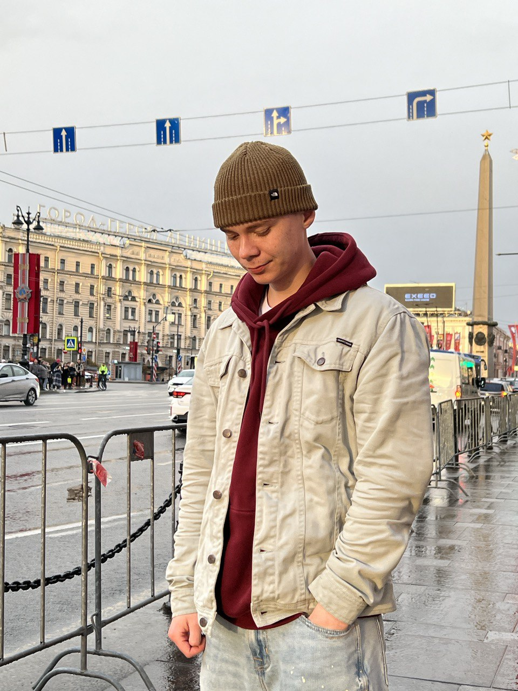

### Привет, меня зовут Антон! /* Hello there! My name is Anton! */
### Обо мне: /* About me: */
* Начинающий Frontend-разработчик из России,город Москва /* I am Junior Frontend Developer from Russia, Moscow */
* Придерживаюсь чистого и аккуратного кода /* Only clear and neat code by me */
* Ищу работу на которой смогу проявить себя как разработчик и освоить новые технологии.
  /* Looking for a job where I can prove myself as a developer and learn new technologies.*/
### Мой стек: /* My stack: */

  

  

  

  

  

  

  

  

 

### Знание языков: /* Languages: */
* `Russian (Русский) - Native (Родной)`
* `English (Английский) - B1 (ниже среднего)`

### Контакты: /* My contacts: */
  

* Telegram: @pepsikolny01

 Email: a_yushachkov@mail.ru
